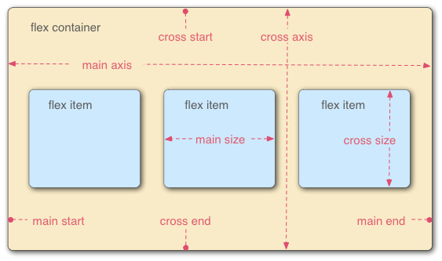
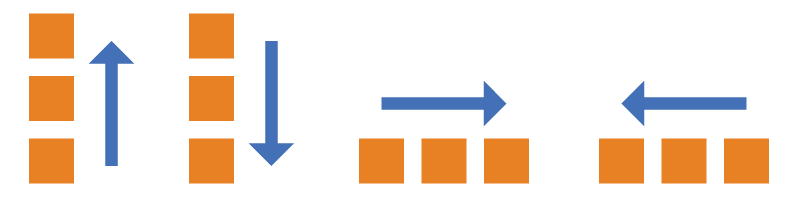
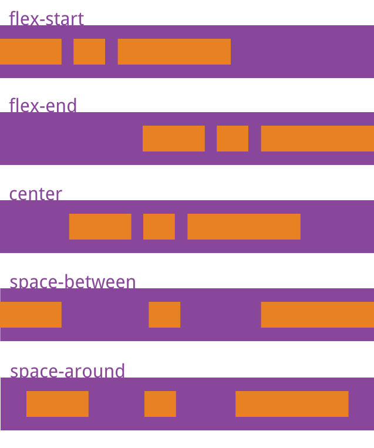
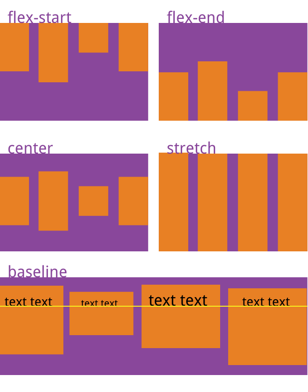

学习资料为：https://www.ruanyifeng.com/blog/2015/07/flex-grammar.html
做题资料为：https://www.ruanyifeng.com/blog/2015/07/flex-examples.html
1. 基本概念

flex容器默认有两个轴
- 水平的主轴 main axis, 主轴的起始位置为main start ，结束位置 main end
    - 按照主轴排列，单个项目占据的主轴空间叫做main size ，占据的交叉轴空间叫做cross size
- 垂直的交叉轴 cross axis， 交叉轴的起始位置为 cross start，结束为止 cross end

- flex-direction属性 ：决定主轴的方向

.box{
    flex-direction: row | row-reverse | column | column-reverse
}
row: 主轴为水平方向，起点为左边
row-reverse: 起点在右边
column：主轴为垂直方向，起点在上沿
column-reverse: 主轴为垂直方向，起点在下沿

- flex-wrap属性：用于定义是否换行，默认nowrap

- justify-content属性：定义项目在主轴的对齐方式

- flex-start（默认值）：左对齐
- flex-end：右对齐
- center： 居中
- space-between：两端对齐，项目之间的间隔都相等。
- space-around：每个项目两侧的间隔相等。所以，项目之间的间隔比项目与边框的间隔大一倍。

- align-item属性：定义项目在交叉轴的对齐方式

- 以下是设置在项目上的属性
- align-self属性：允许单个项目与其他项目不一样的对方式，这是修改交叉轴的